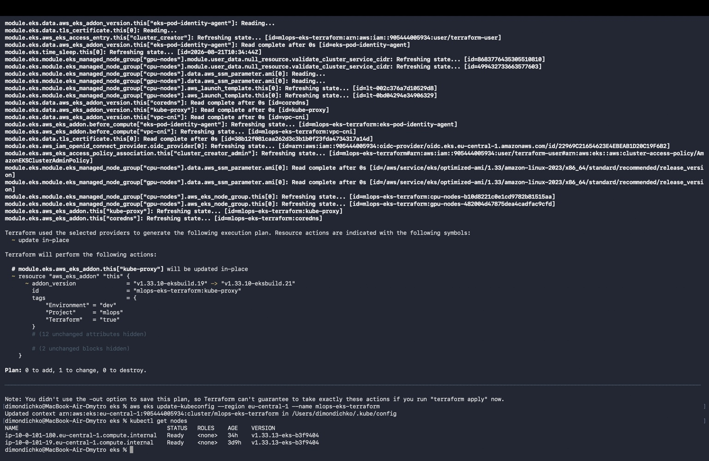
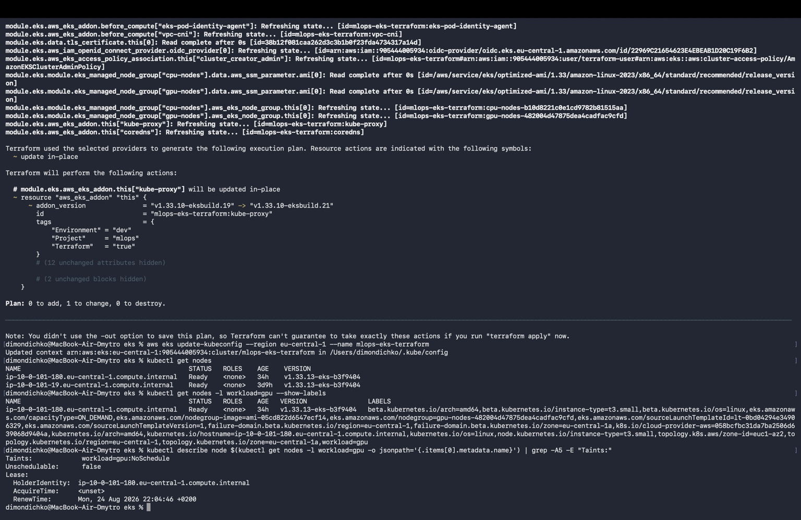
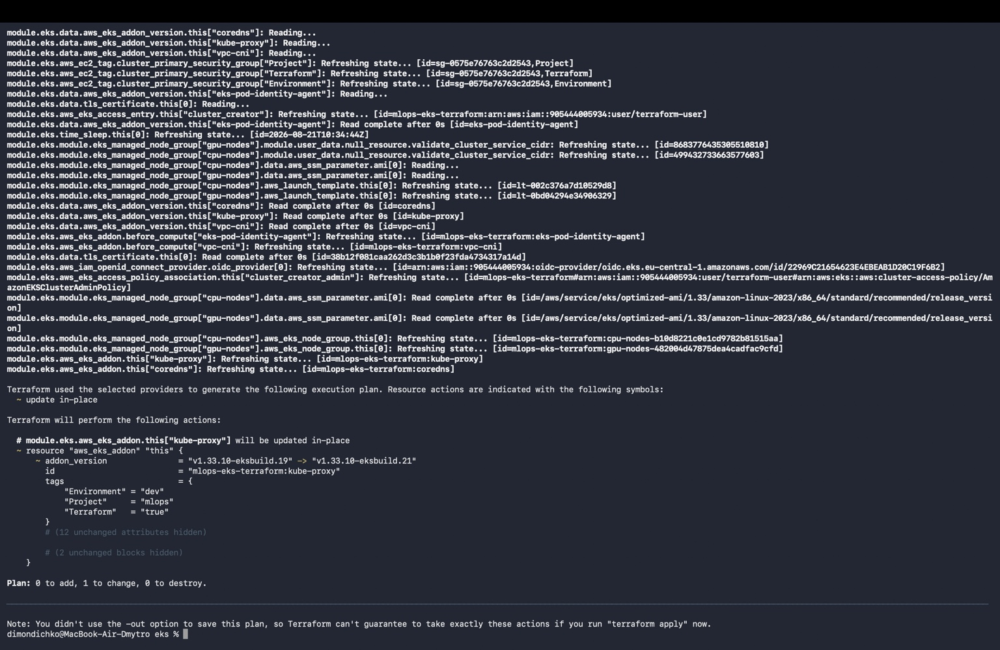
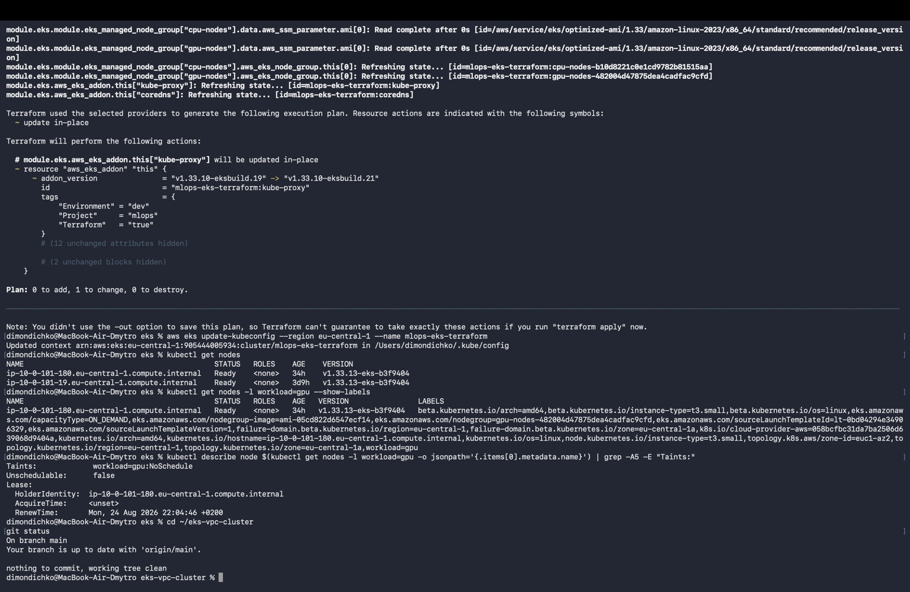
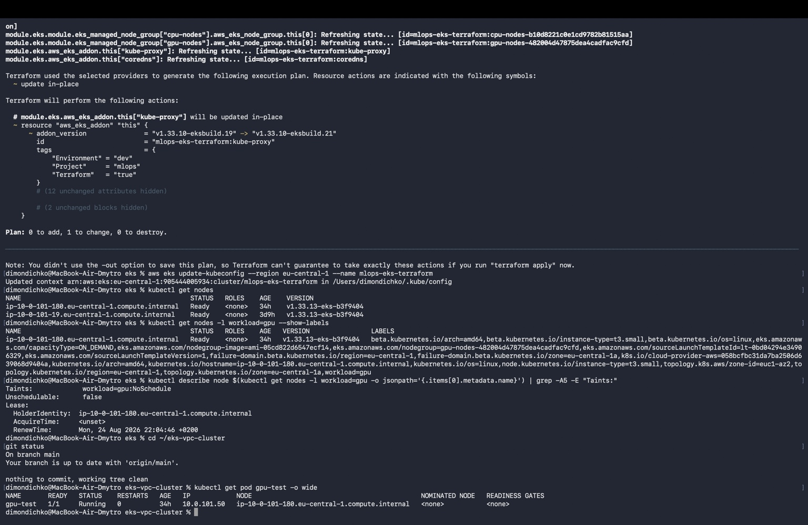

# EKS VPC Cluster — Terraform

## Опис

Цей проєкт демонструє створення базової AWS-інфраструктури для майбутніх ML/MLOps-сервісів за допомогою Terraform.

Інфраструктура складається з двох незалежних Terraform-конфігурацій:

- `vpc/` — створення VPC та мережевої інфраструктури;
- `eks/` — створення EKS-кластера та node groups.

Зв'язок між VPC та EKS реалізований через `terraform_remote_state`.

## Структура проєкту

```text
eks-vpc-cluster/
├── vpc/
│   ├── main.tf
│   ├── variables.tf
│   ├── outputs.tf
│   ├── terraform.tf
│   ├── backend.tf
│   └── .terraform.lock.hcl
├── eks/
│   ├── main.tf
│   ├── variables.tf
│   ├── outputs.tf
│   ├── terraform.tf
│   ├── backend.tf
│   ├── data.tf
│   └── .terraform.lock.hcl
├── docs/
│   └── screenshots/
└── README.md
```

## 1. VPC

VPC створюється за допомогою офіційного модуля `terraform-aws-modules/vpc/aws`.

Конфігурація містить VPC CIDR, public/private subnets, кілька Availability Zones, NAT Gateway, S3 backend та outputs `vpc_id`, `public_subnets`, `private_subnets`.

### Перевірка VPC

```bash
cd vpc
terraform init
terraform validate
terraform apply
terraform output
```



## 2. EKS

EKS створюється за допомогою офіційного модуля `terraform-aws-modules/eks/aws`.

Дані VPC отримуються через `terraform_remote_state` у `eks/data.tf`.

### Перевірка конфігурації

```bash
cd ../eks
terraform init
terraform validate
terraform plan
terraform apply
```



## 3. Node groups

У кластері створено дві node groups:

- `cpu-nodes` — для звичайних CPU workloads;
- `gpu-nodes` — окрема workload node group.

Через обмеження навчального середовища для `gpu-nodes` використовується невеликий `t3.small`. Ця node group демонструє принцип workload-ізоляції, а не фізичну наявність GPU.

Workload node має label:

```text
workload=gpu
```

і taint:

```text
workload=gpu:NoSchedule
```

Це дозволяє ізолювати workload-навантаження від звичайних CPU workloads.

## 4. Перевірка Kubernetes

Після створення EKS-кластера:

```bash
aws eks --region eu-central-1 update-kubeconfig --name mlops-eks-terraform
kubectl get nodes
```

Worker nodes мають статус `Ready`.



### Перевірка workload node

```bash
kubectl get nodes -l workload=gpu --show-labels
```

```bash
kubectl describe node $(kubectl get nodes -l workload=gpu -o jsonpath='{.items[0].metadata.name}') | grep -A5 -E "Taints:"
```

Очікуваний результат:

```text
Taints:
  workload=gpu:NoSchedule
```



## 5. Перевірка workload Pod

Для перевірки ізоляції workload використовується тестовий Pod `gpu-test` з відповідними `nodeSelector` та `toleration`.

Перевірка:

```bash
kubectl get pod gpu-test -o wide
```

Pod має статус `Running` та розміщений на workload node.



## 6. terraform_remote_state

Зв'язок між VPC та EKS реалізований через `terraform_remote_state`.

Файл `eks/data.tf` отримує outputs з VPC Terraform state:

- `vpc_id`;
- `public_subnets`;
- `private_subnets`.

VPC та EKS мають окремі backend-конфігурації та state.

## 7. Порядок запуску

Спочатку VPC:

```bash
cd vpc
terraform init
terraform apply
```

Потім EKS:

```bash
cd ../eks
terraform init
terraform apply
```

Після створення кластера:

```bash
aws eks --region eu-central-1 update-kubeconfig --name mlops-eks-terraform
kubectl get nodes
```

## 8. Видалення ресурсів

Щоб уникнути зайвих витрат AWS, після перевірки ресурси потрібно видалити.

Спочатку EKS:

```bash
cd eks
terraform destroy
```

Потім VPC:

```bash
cd ../vpc
terraform destroy
```

Порядок важливий, оскільки EKS залежить від VPC.

## Висновок

У результаті створено дві незалежні Terraform-конфігурації `vpc/` та `eks/`.

Проєкт використовує офіційні Terraform-модулі VPC та EKS, `terraform_remote_state`, S3 backend, outputs та окремі CPU/workload node groups.

Доступ до EKS перевірено через `aws eks update-kubeconfig` та `kubectl get nodes`. Worker nodes знаходяться у статусі `Ready`, а workload node ізольована за допомогою label `workload=gpu` та taint `workload=gpu:NoSchedule`.
